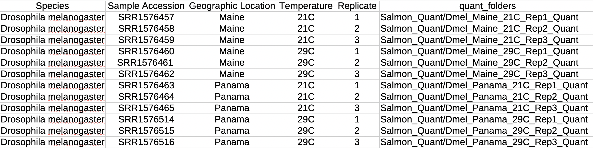
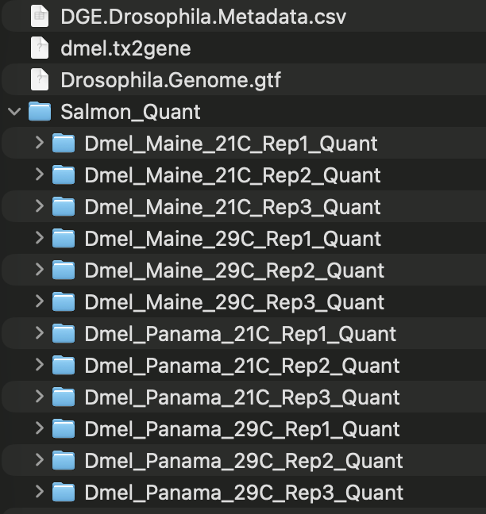
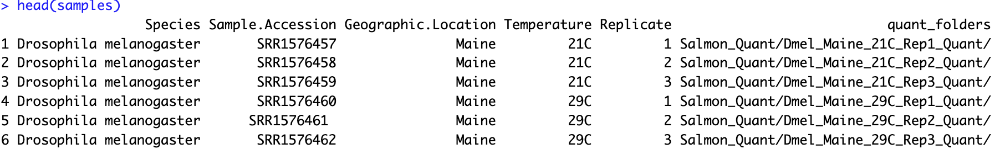
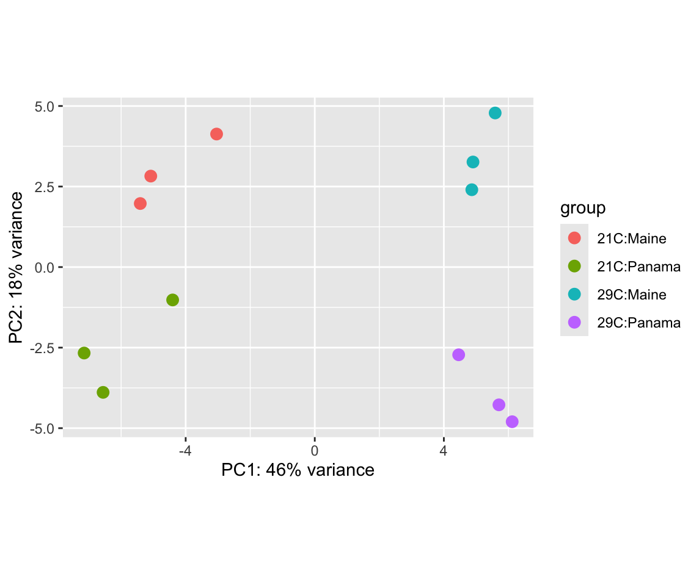
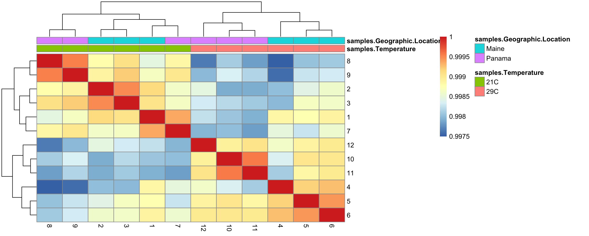
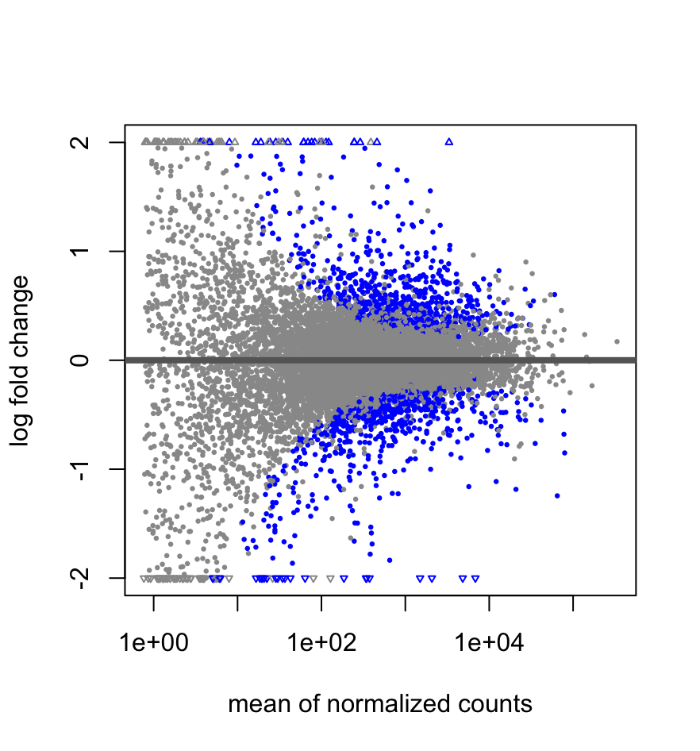
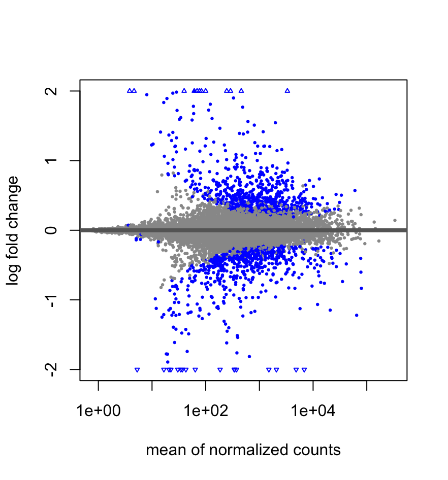

# Goals of the lab overall

The skills acquired in this lab class are crucial for bioinformatic tasks using molecular data, such as data analysis, scripting,
and working in high-performance computing (HPC) environments. My hope is that you don’t just type the commands into the terminal and
move on -- I would like you to ***think*** about what these commands are doing and start imagining how they could be useful in analyzing your own data.

## For your success in the lab
Each lab is inteded to be a reference point for you on various bioinformatic tasks.
To make the most of these labs, please treat them like a **personal resource**, so
adjust any specific commands accordingly.

---

# Lab Deep-dive

---

### Overview of today's lab
Today's lab will focus on finally assessing differential gene expression in our
test datasets (yay)! At this point, it is crucial that you take a moment to recognize
how much work you have done (it's a lot). Try and take a couple minutes to deeply
understand what steps you have taken to generate and prepare the data for today's
lab.

Many of you will likely choose to repeat this work in your project, so getting
help now, while the work is still more fresh, is important. Again, the greatest
aim in this lab course is to build your comfort interacting with the HPC and
handling files. This is where repetition is really powerful, as it really is
**practice, practice, practice**!

Make sure to ask questions as needed!

### Moving files, `DESeq2`, Differential Gene Expression!
- [ ] Logging on to the HPC!
- [ ] Downloading the `Salmon Quant` files from the HPC
- [ ] Importing the metadata into R
- [ ] Assessing differential gene expression!
- [ ] Summary plots and sample assessment!

---

## Preparing today's lab
Today, we will working with the transcript quantification data prepared in the
last lab, which used the previously published *Drosophila melanogaster* data.

If you have not already, you should make a folder on your Desktop for today's lab.
You can name this anything you want (I am going to call mine `DGE_Analysis`)

1. Open **two** terminal windows.

2. In **one** of those terminals, log onto the HPC

4. On the HPC and in your lab folder in `scr10`, you should move into your
`transcript_quantification` folder
   ```bash
   YOUR CODE HERE
   ```

5. Use `pwd` to view the `PATH` to this folder. Make sure to copy this path!

6. Using your **local** terminal (not connected to the HPC), move into today's folder
(again, I called mine `DGE_Analysis`)
   ```bash
    YOUR CODE HERE
    ```

7. You will use your **local** terminal (not connected to the HPC) to download
the data from the `Salmon_Quant` folder.
   ```bash
   scp -r wm-username@bora.sciclone.wm.edu:[PASTE-THE-PWD-PATH]/Salmon_Quant ./
   ```

   `scp` works by moving files **from** a location **to** another location.

   By putting the files from the HPC first, `scp` will copy those files **from**
   the HPC **to** your computer.

8. Once your **local** terminal says the files have downloaded, you can close
the terminal connected to the HPC. Do not close your local terminal yet!


---

## Preparing `R-Studio`

Today, we will be using `DESeq2` to perform the differential gene expression, which
is a fantastic tool built for `R`. To use it though, we will need to install some
`R` packages to make sure it works.

To make life easy, I recommend making a new `R-script` to save today's commands.
This will make a great reference point for yourself in the future!

1. We have a number of tools to install in `R`. Fortunately, this is very easy with
the `install.packages()` command. Like `conda`, there is a special package manager
for `R` that handles biology-related tools, called `Bioconductor`. We will install
this first as it will manage the installs for the remaining `R` packages.
   ```r
   if (!require("BiocManager", quietly = TRUE))
    install.packages("BiocManager")
   ```


2. For the remaining software, I will provide you with *one* install command,
and you will have to install the remaining software in the list that follows.
You will likely be prompted to update things when trying to install the additional
software. When that happens just update all the packages, `a`.
   ```r
   BiocManager::install("tximport")
   ```

   - [ ] `readr`
   - [ ] `DESeq2`
   - [ ] `apeglm`
   - [ ] `txdbmaker`
   - [ ] `AnnotationDbi`
   - [ ] `pheatmap`

Note that you will only need to install the software ONE time!

3. Now that everything is installed, we need to "import" those tools. Again, I
will provide a single example, and you should go ahead and repeat it for all the
tools installed.
   ```r
   library("tximport")
   ```

Great, now the tools for `R` are all loaded and prepared! We now need to do a little
more preparation before we can do the analysis itself.

---

# Preparing Data for DESeq2
There are a good number of steps to actually prepare our data for analysis with
DESeq2. Today's lab will largely focus on the data preparation and quality checking.

We will wrap up this week's lab by running `DESeq2`, but will likely save the
deeper analyses for next week.

---

## Trasncript-to-Gene-Name Table

While `Salmon` quantifies expression based on ***transcripts***, we tend to want
to explore ***gene-level*** expression instead, which is what we will be doing!
It does make the interpretation a bit more simple, but it also means that we need
to prepare the transcript-to-gene table.

Fortunately, we just need the `.gtf` file, which can be downloaded from Blackboard.

Below, are the steps to prepare this table.

1. You will create the transcript-db table from the `Drosophila.Genome.gtf` file.
To do this, you will need the `PATH` to this file. This is pretty easy to do!

   Find this file on your computer, then drag it into your terminal! You should
   see the file's `PATH`.

   Make sure to copy this path!

2. We can put this `PATH` into `R-Studio`
   ```r
   txdb <- makeTxDbFromGFF(file = "PATH-TO-GTF-FILE", format = "gtf")
   ```

3. Now we need to extract the transcript names
   ```r
   k <- keys(txdb, keytype = "TXNAME")
   ```

4. Now we can pair each transcript name with its corresponding gene ID. Remember,
all gene ID's are unique and may have multiple transcripts (isoforms) corresponding
to them. We want to "flatten" this to make it easier to analyze.
   ```
   tx2gene <- select(txdb, keys = k, columns = "GENEID", keytype = "TXNAME")
   ```

5. `R` is fantastic, because it makes it easy to see the data as well. We can check
out the first few rows of this transcript-to-gene table using `head()`
   ```r
   head(tx2gene)
   ```

6. While we can move on with the remaining preparation steps and analysis, it is
***always*** a good idea to save these types of tables, just in case. We will save
the table in the same place as the `DGE.Drosophila.Metadata.csv` file, to keep them
together.

  Copy the `PATH` to the `DGE.Drosophila.Metadata.csv`, *excluding* the filename!
  We just want the folder location.

7. Using the `PATH` you copied, let's save the table.
   ```r
   write.csv(tx2gene, file = "PATH-TO-GTF-FILE/dmel.tx2gene", row.names = FALSE)
   ```

Now we just need to update the meta-data table and we are nearly set!

---

## Preparing the Meta-Data Table

To make life as easy as possible, we are going to add a little more information
to the `DGE.Drosophila.Metadata.csv` file. In fact, we are going to link each
sample (row) in the table to the `PATH` to the corresponding transcript quantification
output file (`quant.sf`) generated by `Salmon`.

1. In your **local** terminal, navigate to the folder that has all of your folders
generated by `Salmon`. Mine are in the `Salmon_Quant` folder still.
   ```bash
   YOUR CODE HERE
   ```

2. In the `DGE.Drosophila.Metadata.csv` file, make a new column called `quant_folders`.
   Each row will need you to paste the folder that the `Salmon` output folders are in,
   as well as the folder for that specific replicate.

   For me, the very first sample would be `Salmon_Quant/Dmel_Maine_21C_Rep1_Quant`

   

At this point, your folder with all the relevant data should look something like this:

{width=40% fig-align="center"}

---

## Putting Everything Together
We are finally prepared to run the differential gene expression analysis! Well,
almost ready. The steps below are predominantly for `R` and will let you know explicitly
when you need to access the terminal.

1. Using your terminal (right away, ha!), find and copy the path to your
`DGE.Drosophila.Metadata.csv` file.
   ```bash
   YOUR CODE HERE IF NEEDED
   ```

2. In your `R` script, we need to make a variable, `dir`, that has the `PATH` to
your folder. This ***should*** be the same as the path you copied above, just removing
the file.
   ```r
   dir <- "PATH-TO-FOLDER"
   ```

3. Next is to make another variable, `samples`. We will pass it the location of
the `DGE.Drosophila.Metadata.csv` file, which has all of the information for the
analysis.
   ```r
   samples <- read.csv(file.path(dir, "DGE.Drosophila.Metadata.csv"))
   ```

   `read.csv()`: tells the code to read a comma-separated-values file
   `file.path()`: tells `R` to find the path to the file located in a specific directory
   When combined (as in the command above) it finds the table, reads it, ***and***
   saves its contents to `samples`

4. Let's look at the first few lines of `samples`, using `head()`
   ```r
   head(samples)
   ```

   

   You should see all the meta-data that we need!

5. Now we need to tell `R` where the `quant.sf` files are in our folder. We will
save those locations to another variable, `quant_files`
   ```r
   quant_files <- file.path(dir, samples$quant_folder, "quant.sf")
   ```

   Also, it's a good time to use `head` to just check that everything looks right too!

   ```r
   YOUR CODE HERE
   ```

6.  Now, we need to link the `quant.sf` files to the `tx2gene` data we prepared.
This also serves as an opportunity to tell `R` that the data were generated using
`Salmon`
   ```r
   txi <- tximport(quant_files, type = "salmon", tx2gene = tx2gene)
   ```

7. We are at a critical part in preparing our data for DESeq2. Many experiments
are designed to be relatively simple, such as untreated **versus** treated. However,
*our* data have two big variables to test that could impact our analyses:
temperature and location.

   It could be that the predominant difference in gene expression is driven by one
   of these factors. Although it is more likely that it is a combination of temperature
   ***and*** location. We need to tell `DESeq2` that there may be an *interaction*
   between these variables.

   `DESeq2` by default knows nothing, and so the very last step towards preparing
   data for the analysis is to describe the experiment.

   For our data, given that it is "multi-factor" and that the differentially expressed
   genes may be a result of the ***interaction*** between temperature and location,
   we will make sure our design reflects that.

   To make the downstream work easier, we are going to explicitly make "groups" following
   our meta-data table. This will make it possible to make our broad comparisons more easily.

   Let's go ahead and explicitly describe our groups
   ```r
   samples$group <- factor(paste(samples$Geographic.Location, samples$Temperature, sep = "_"))
   sampls$group
   ```

   You should see that each sample is similarly named to our metadata, with the
   geographic location AND the temperature!

8. Finally, we can prepare

   ```r
   dds <- DESeqDataSetFromTximport(txi, colData = samples, design = ~ group)
   ```

   ::: {.callout-tip title="DESeq2's design"}
   The `design` argument in `DESeq2` tells the software what variables could be
   contributing to the observed differential gene expression.

   While we are using a multi-factor design, much of the time, research is just
   exploring a single variable (we will call it `sample_type` for this
   example), with multiple conditions (e.g., control, treatment-1, treatment-2):

   ```r
   design = ~ sample_type
   ```

   `DESeq2` has an amazing manual with some examples for other designs, so check
   there for more!
   :::

---

## Quality Checking ***BEFORE*** DGE!
Before we run our differential gene expression analysis, it is always nice to explore
your data ahead of time. The focus here is to know if any of your samples are behaving
unexpectedly, which could reflect a technical issue or some biological chaos!

From experience, there is the occassional mis-labeling of a sample, which can make
the analysis challenging or impossible. Personally, if we are seeing that there is
a strong likelihood that a sample is mis-labelled, you really have two options:
1) keep the mis-labelled sample as it is (personal preference) or 2) remove it from
the study. Be aware that this does happen, and I recommend the most conservative (i.e., careful)
approach is the "best" approach.

Alright, let's dive in!

1. Let's take a look at the actual data that we prepared for `DESeq2`
   ```r
   View(counts(dds))
   ```

   In this table you will notice that there are 12 samples (columns) and many rows
   (genes). The values are the read "counts" generated by `Salmon`

   

2. Before we visualize the data, we are going to normalize the read counts to improve
the data visualization steps. This is not always necessary, but it often makes for
more appropriate comparisons. We will be using the regularized-logarithm transformation
that is part of the `DESeq2` package.

   It is important to note that `DESeq2` will use the *raw* read counts for the actual
   analysis, so do not pass the normalized values.

   ```r
   rld = rlog(dds, blind = TRUE)
   ```

   - `blind`: makes sure that `rlog` only looks at the counts and ignores all the other metadata!

3. Now we can run the principal components analysis, which a dimension reduction
technique to visualize complex datasets in 2-D (i.e. graphs!). We will talk about
how this works in class!
   ```r
   plotPCA(rld, intgroup = 'Temperature')
   ```

   - `intgroup`: provide a variable to distinguish your groups!

   Go ahead and try replacing `Temperature` with `Geographic.Location`.

   What do you notice?

   The axis labels describe the variance in the dataset. In this dataset, the
   x-axis (PC1`) and y-axis (`PC2`) account for 46% abd 18% of the variance, respectively.
   What is cool is that you can simply sum those values to get an idea of how much
   variability in your data are explained by these two axes, which is ~64% (this is pretty high!)

   So cool!

4. Did you know that you can run the `plotPCA` with ***two*** variables to put on the plot?
   ```r
   plotPCA(rld, intgroup = c('Temperature', 'Geographic.Location'))
   ```

   How cool is this? (very ***very*** cool)

5. In your plots you should notice that there is reasonable distance between each
temperature and location! That's a pretty nice dataset even without any data cleaning!

   

6. The only other exploratory analysis we will do is some `hierarchical clustering`.
Before we do this, we do need to extract some information from our big `samples`
dataframe. This will make the visualization easier.
   ```r
   meta <- data.frame(samples$Temperature, samples$Geographic.Location, row.names = colnames(txi$counts))
   ```

   We are just linking the variables we are testing to the samples themselves

7. Hierarchical clustering can be done many ways, but for today, we will simply
explore the correlation between our raw samples. It is pretty straightforward to
generate the pairwise correlation matrix
   ```r
   # converts the dataframe to a matrix
   rld_mat <- assay(rld)

   # generates the pairwise correlation matrix from the raw matrix
   rld_corr <- cor(rld_mat)
   ```

8. Now we can do the visualization, using `pheatmap`. All this will need is our
correlation matrix and our mini-metadata table.
   ```r
   pheatmap(rld_corr, annotation = meta)
   ```

   What do you notice?

9. Interestingly, there is a clear separation of the data by temperature (whew).
You might also notice that in the samples from `21C` that one of the `Panama` samples
is next to the `Maine` samples. This is a bit surprising, but I would not worry
too much!

   With correlation values so high (>0.99) there really are no outlier samples that
   we need to worry about.

   

The data look ready for our analysis!

---

# Running the DGE Analysis!

You made it! Now that we are sure the data look nice enough to work with, we can
run the analyses!

1. Last thing before we un the analysis, is that we should remove rows (genes) that
really contain no information/data. The common approach is to remove any row that
has <10 reads in it (summed across all samples)
  ```r
  good_rows <- rowSums(counts(dds)) >= 10
  dds <- dds[good_rows,]
  ```

2. Now we can run our analysis!
   ```r
   dds <- DESeq(dds)
   ```

3. It's as simple as that!

---

# Assessing DGE Results

Now is the fun part, exploring the results. We will just look at one of these today
and do more next week, with some deeper visualizations and interpretations.

For today, let's explore the differential expression between low and high temperature
exposed flies from Maine.

1. To determine which samples we want to explore, we need to specify `constrasts`.
You can see the potential contrasts from the analysis.
   ```r
   resultsNames(dds)
   ```

   You will see some unclear names... but it's okay!

2. It is nice and straightforward to explore specific comparisons. In general, below
is the code to get the result for a specific pair of comparisons:
   ```r
   result_sample_cond1_cond2 <- results(dds, contrast = c("sample", "cond2", "cond1"))
   ```
   `cond1` will be our reference point, so we are seeing what is differentially expressed
   ***relative*** to this condition!

3. Let's assess the differential gene expression between temperatures in the Maine population
  ```r
  result_maine_21C_29C <- results(dds, contrast = c("group", "Maine_29C", "Maine_21C"), alpha = 0.05)
  summary(result_maine_21C_29C)
  ```

4. Before we look at the results, we should also adjsut the p-values using a
generalized linear model (`apeglm`), which will make our estimates for differential
expression a bit more conservative.
   ```r
   res_maine_21_29_apeglm <- lfcShrink(dds, coef = "group_Maine_29C_vs_Maine_21C", type = 'apeglm', res = result_maine_21C_29C)
   summary(result_maine_21C_29C)
   ```

   Did you notice any difference in the summaries?

5. Let's make some MA plots to visualize our results!

   We will start with the "raw" results

   ```r
   plotMA(res_maine_21_29, ylim=c(-2,2))
   ```

   You should notice that there is some wide dispersion of the data with low
   normalized counts

   Now comnpare that to the "lfcShrink" results!

   ```r
   plotMA(res_maine_21_29_apeglm, ylim=c(-2,2))
   ```

   That dispersion is now gone! This is important as the log2-fold-change is a
   major means that we use to filter our datasets.

   ::: {layout-ncol=2}
   

   
   :::


6. Final thing for today is to save those results to a table! We will
   ```r
   out_csv <- file.path(dir,"Maine.21C_29C.DEG.csv")
   write.csv(as.data.frame(res_maine_21_29_apeglm), file = out_csv)
   ```

Alright, tons happened in this lab. You should explore some of the other contrasts
on your own and try to come up with some ideas of what this might mean, biologically!

---

# Quick Start Guide

---

This is for your reference in the future, so you don't have to slog through all the work above!
Also, what a great way to practice this week :)

Below, the steps are numbered with emtpy code blocks below them. Copy-paste your commands there!

With the packages installed, you will not need to run the installation a second time!

1. Load the libraries for the analyses
   ```bash
   YOUR CODE HERE
   ```

2. Read the `tx2gene` table. You just need to put the `PATH` in its place
   ```bash
   tx2gene <- read.CSV(PATH-TO-TX2GENE-TABLE)
   ```

3. Read your meta-data file. I recommend using the `dir` and the filename like in this lab
   ```bash
   YOUR CODE HERE
   ```

4. Have `R` find your `quant.sf` files
   ```bash
   YOUR CODE HERE
   ```

5. Link the gene-IDs to the outputs from Salmon with `tximport`
   ```bash
   YOUR CODE HERE
   ```

6. Set up your experimental design
   ```bash
   YOUR CODE HERE
   ```

7. Prepare the `DESeq2` dataframe
   ```bash
   YOUR CODE HERE
   ```

8. Explore your dataframe, if you would like!
   ```bash
   YOUR CODE HERE
   ```

9. Remove rows from the `DESeq2` dataframe that are essentially "empty"
   ```bash
   YOUR CODE HERE
   ```

10. Run `DESeq2`
   ```bash
   YOUR CODE HERE
   ```

11. Check the comparisons you can do
   ```bash
   YOUR CODE HERE
   ```

12. Get the raw results from your contrast you want to compare
   ```bash
   YOUR CODE HERE
   ```

13. Make sure to adjust the log2-fold change with `lfcShrink`
   ```bash
   YOUR CODE HERE
   ```

14. Make the MA-plot
   ```bash
   YOUR CODE HERE
   ```

15. Save the results table for this particular comparison
   ```bash
   YOUR CODE HERE
   ```
